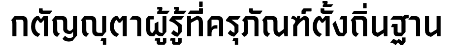
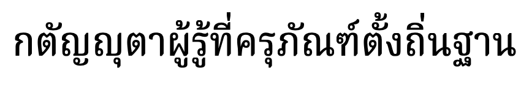

# Text-to-Image Converter

This project demonstrates the usage of Pango, a library for laying out and rendering text, with a focus on internationalization. It includes both C# and Rust implementations for converting text to images.

## Project Structure

- `src/PangoTest/`: Contains the C# implementation
  - `PangoTest.csproj`: The C# project file
  - `Program.cs`: The main C# program file
- `app/text-to-image/`: Contains the Rust implementation
  - `Cargo.toml`: The Rust project file
  - `src/main.rs`: The main Rust program file

## Prerequisites

For C#:
- .NET Core SDK 3.1 or later
- Pango library and its dependencies (libpango1.0-dev)
- Cairo graphics library (libcairo2-dev)

For Rust:
- Rust toolchain (1.55.0 or later recommended)
- Cairo and Pango libraries (same as C# requirements)

## Installation

1. Clone the repository:
   ```
   git clone https://github.com/yourusername/text-to-image-converter.git
   cd text-to-image-converter
   ```

2. Install the required dependencies for your chosen implementation (C# or Rust).

## Building and Running

### C# Version

1. Navigate to the C# project directory:
   ```
   cd src/PangoTest/
   ```

2. Build the project:
   ```
   dotnet build
   ```

3. Run the program:
   ```
   dotnet run
   ```

### Rust Version

1. Navigate to the Rust project directory:
   ```
   cd app/text-to-image/
   ```

2. Build and run the project:
   ```
   cargo run
   ```

## Features

- Converts text to high-quality image using Pango and Cairo
- Supports internationalized text, including complex scripts like Thai
- Customizable font selection and font size
- Automatically adjusts image size based on text content
- Outputs PNG image files

## Usage

Both C# and Rust versions accept command-line arguments for customization:

```
text-to-image <text> <font_description> <output_path>
```

- `<text>`: The text to convert (use quotes for multi-word text)
- `<font_description>`: Pango font description (e.g., "Sans 12")
- `<output_path>`: Path for the output PNG file

Example:
```
text-to-image "Hello, World!" "Sans 24" output.png
```

## Sample Output

The project includes sample output demonstrating its capabilities with Thai text:

กตัญญุตาผู้รู้ที่ครุภัณฑ์ตั้งถิ่นฐาน

This text showcases the ability to render complex Thai script, including intricate characters and word combinations.



